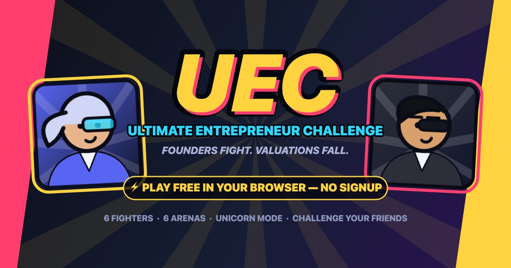
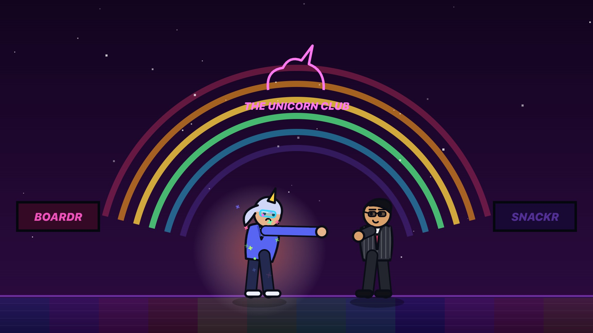
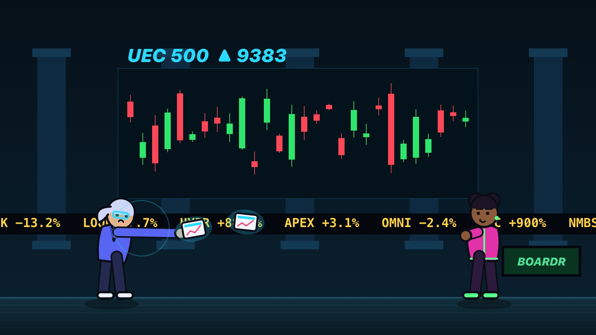

# UEC — Ultimate Entrepreneur Challenge 🥊



**Founders fight. Valuations fall.** A launch-ready browser arcade fighter where entrepreneurs battle 1-v-1 with Pitch Deck Strikes, Hostile Takeovers and full-meter **UNICORN MODE** — inspired by the pacing of 1990s arcade fighters, built with a fully original cast, art, and sound.

Playable in seconds: no account, no install, no build step. **100% vanilla JavaScript + Canvas + Web Audio — zero dependencies, zero asset files.** Every sprite is drawn and every sound is synthesized in code, so there is nothing to license and nothing to download.

---

## Quick start

Any static file server works. From this folder:

```bash
# option A (nothing to install)
python3 -m http.server 4173

# option B (dev server with no-cache headers — best while editing)
python3 dev-server.py 4173

# option C (Node)
npx serve -l 4173 .
```

Open **http://localhost:4173** → hit **⚡ QUICK FIGHT**. You're in a match in ~5 seconds.

> ES modules require http(s) — opening `index.html` via `file://` won't work.

## Deploy (any static host)

The whole game is static files. Drop the folder on any of:

- **Vercel** — `npx vercel deploy` (or import the folder in the dashboard; no build command, output dir = `.`)
- **Netlify** — drag-and-drop the folder into the dashboard
- **GitHub Pages** — push and enable Pages
- **Cloudflare Pages** — direct upload

No environment variables, no server, no database.

---

## How to play

Win **2 of 3 rounds** (60 s each): empty your rival's health bar or lead when the bell rings. Landing and taking hits charges your **energy meter** — spend 50 on your Special, or bank a full 100 for **UNICORN MODE** (6 s: +35 % damage, +25 % speed, no chip damage, extremely fabulous).

**Block** cuts damage to 15 % chip (chip can never KO). **Hostile Takeover can't be blocked — jump it.**

| Action | Solo | 2P — left player | 2P — right player | Touch |
|---|---|---|---|---|
| Move | ← → or A D | A D | ← → | ◀ ▶ |
| Jump | ↑ or W | W | ↑ | ▲ |
| Block (hold) | ↓ or S | S | ↓ | 🛡 |
| Punch | J or C | C | J | 👊 |
| Kick | K or V | V | K | 🦶 |
| Special | L or B | B | L | ⚡ |
| Unicorn Mode | U or G | G | U | 🦄 |
| Pause | Esc / P | | | ⏸ |

Touch pads appear automatically on phones/tablets (or force them with `?touch=1`).

## What's new in v1.4

- 🕶 **Famous-founder roster** — the whole cast is now parody legends: **Lizbeth Holmez** (Theramos), **Adam Weumann** (WeWerk), **Steve Jobz** (Pear), **Kim Koindashian** (SkimzCoin), **Cathie Woodz** (ARKK Capital), **Carl Icahnt** (Icahnt Holdings) + the cameo tier (Elo Ma, Jeff Bozo, Scam Alt). 100% satire, 0% affiliation.
- 🥊 **Combat feel pass** — punches/kicks are meaningfully faster (5-frame punch startup), with anticipation wind-ups, harder overshoot, motion-smear arcs and heavier hitstop. Mashing feels *good* now.
- ⚖️ **Cease & Desist** replaces the bomb: hurl legal paperwork in an arc (25 energy). You've been served.
- 💸 **Acqui-Hire** — new universal steal: raid their team at close range and siphon 15 energy into your meter (free, 3.5 s cooldown, blockable/parryable). Chains out of punches for maximum disrespect.
- 🛡 **PARRY** — tap block at the last instant to turn an attack away: attacker staggers, you gain energy. Grabs beat parries; parries beat everything else. Real skill ceiling unlocked.
- 💨 Dash got its proper emoji and moved next to the movement pad on touch.
- 🔐 **Sign-in system** (Google / Microsoft / email magic link via Supabase Auth) — built, wired, and gated behind `AUTH.REQUIRED` in [src/auth.js](src/auth.js) until providers are enabled (see below).

## Enabling sign-in (owner checklist, ~5 min)

Email links are **already enabled** on the Supabase project; OAuth needs credentials. In the [Supabase dashboard](https://supabase.com/dashboard/project/orgjgkatnxvkaleopaja):

1. **Authentication → URL Configuration** — set Site URL to `https://firdous-aurmada.github.io/uec-ultimate-entrepreneur-challenge/` and add it (plus `http://localhost:4173`) to Redirect URLs.
2. **Authentication → Providers → Google** — paste a Client ID/Secret from Google Cloud Console (authorized redirect URI: `https://orgjgkatnxvkaleopaja.supabase.co/auth/v1/callback`).
3. **Authentication → Providers → Azure** — same with a Microsoft Entra app registration.
4. Flip `AUTH.REQUIRED` to `true` in `src/auth.js` and push — the game is now sign-in-gated.

## What's new in v1.3

- 🔗 **Real combos** — attacks now **cancel on hit**: chain Punch ×3 → Kick → Special / 💣 / 🦄. Whiffs still recover in full, chained hits scale down in damage (100/85/70/60/50%), chained jabs shove less so strings stay in range, and milestone callouts fire at 3/5/7 hits (COMBO! → SYNERGY! → DISRUPTED!). Founder and Mogul AIs chain back.

## What's new in v1.2

- 🎁 **Mystery drops** — briefcases parachute into every round carrying **hidden powers** (Secret Funding, 10x Engineer, Legal Shield, To The Moon… and the occasional Toxic Asset). Seeded RNG, so both players in a live match see identical drops.
- 💣 **PR Bomb** (25 energy, arcing blast) and ⚙️ **Hustle Dash** (free gap-closer that cancels into attacks) — two new universal moves on every fighter, keyboard + touch.
- 🕶 **Cameo tier** — three 100%-parody guest fighters: **ELO MA** (SPACEY-X), **JEFF BOZO** (PRIMEZON) and **SCAM ALT** (CLOSEDAI). No affiliation, all satire, very punchable.
- 📣 **Built-in bragging** — one-tap LinkedIn / X / WhatsApp share buttons and a copy-paste brag generator on the results screen. Your share link is your **challenge link**, so anyone who clicks your flex gets called out. Rank-ups get celebrated accordingly.

## The roster (all fictional)

| Fighter | Company | Signature special |
|---|---|---|
| **Lizbeth Holmez** · The Visionary | Theramos | 🔄 **Pivot Punch** — vanishes mid-claim, reappears fist-first |
| **Adam Weumann** · The Burner | WeWerk | 🔥 **Burn Rate Blast** — point-blank $47B inferno |
| **Steve Jobz** · The Keynote | Pear | 📊 **Pitch Deck Strike** — one more thing: 3 razor slides |
| **Kim Koindashian** · The Influencer | SkimzCoin | 📈 **Growth Hack** — viral rush that locks in a 4-hit flurry |
| **Cathie Woodz** · The Believer | ARKK Capital | 💰 **Funding Round** — buys every dip, rains gold |
| **Carl Icahnt** · The Raider | Icahnt Holdings | 🦈 **Hostile Takeover** — unblockable command grab |

| Unicorn Mode in The Unicorn Club | Pitch Deck Strike on The Stock Exchange |
|---|---|
|  |  |

Everyone shares 🦄 **Unicorn Mode** at full meter. Fighters have distinct speed/power/HP stats and AI personalities (aggression, jumpiness, preferred range) across three difficulties: **Intern / Founder / Mogul**.

**Arenas (6, all animated):** The Boardroom · Demo Day · The Startup Garage · The Stock Exchange · The Unicorn Club · The VC Summit — with live tickers, sweeping spotlights, bouncing crowds, disco floors, and data-driven billboard slots (see *Sponsorships* below).

## Feature checklist

- ⚡ **Guest play** — no signup; first fight includes a 3-card tutorial + in-match hints
- 👤 **Founder profiles** — name, company, **photo upload with automatic face capture** (on-device face detection in every browser via a vendored MIT detector — picojs — with drag/pinch fine-tuning; photos never leave the device) → becomes your fighter's face, base style, custom suit/accent colors, choice of any signature special
- 🔴 **LIVE multiplayer** — create a room, send the link, and fight a friend in real time. The inviter is notified the second their rival joins; both pick fighters, the host picks the arena, and the match runs deterministic 60 Hz lockstep over Supabase Realtime with input-delay netcode, packet-loss healing, desync detection, both-consent rematches, and graceful disconnect handling. Backgrounded tabs keep simulating via a Web Worker so you never freeze your opponent.
- 🤖 **Vs AI** (3 difficulties) · 👥 **local 2-player** (one keyboard) · 🔗 **async call-out links** (serverless: the link carries your fighter; friends battle your AI ghost anytime)
- ⚔️ **Challenges screen** — live rooms, call-out links, and 10 seeded rival founders at their skill tier
- 🏆 **Leaderboard** — seeded season + you, with W-L, KOs, streaks and rank titles (Garage Dreamer → Decacorn)
- 📈 **Ranked points** — win = 20 × difficulty (×1/×1.5/×2.5, challenges ×2) + 5/KO round + streak bonus; a loss still pays +3
- 📸 **Shareable result cards** — 1200×630 PNG (download or native share)
- 🔊 **Sound controls** — master volume, music & SFX toggles, one-tap mute; all audio synthesized live
- 📱 **Mobile-ready** — responsive layouts + multi-touch pads; auto-pause when the tab hides
- 🔁 **Rematch / change fighter / restart** flows everywhere you'd expect

## Project layout

```
index.html            all screens & modals (DOM shell)
styles.css            visual system (arcade gold/pink/cyan on deep navy)
dev-server.py         no-cache static server for development
src/
  config.js           every gameplay number: physics, frame data, meter, points, ranks
  state.js            localStorage save: profile, stats, settings + challenge-link codec
  main.js             boot, screen router, match lifecycle, render loop, debug hooks
  data/fighters.js    roster definitions + specials metadata + custom/ghost builders
  data/arenas.js      six procedural animated arenas + sponsor billboard slots
  data/seed.js        seeded leaderboard entries
  engine/game.js      match controller: rounds, timer, hit resolution, KO cinematics
  engine/fighter.js   fighter entity: state machine, physics, attacks, specials
  engine/ai.js        AI controller (difficulty × per-fighter personality)
  engine/input.js     keyboard + multi-touch → virtual gamepads; Controller contract
  engine/drawFighter.js  procedural character rig, outfits, faces, photo heads, portraits
  engine/render.js    frame compositor (arena → shadows → fighters → projectiles → FX)
  engine/fx.js        particles, comic word popups, shake, hitstop, rings, flashes
  engine/audio.js     Web Audio SFX recipes + generative per-arena music loop
  ui/hud.js           health/energy bars, timer, pips, announcements, combos, hints
  ui/screens.js       select / profile / challenges / leaderboard / help / modals
  ui/resultCard.js    social result-card renderer
  ui/tutorial.js      first-fight onboarding
  net/online.js       future-multiplayer interface (see below)
```

**Seed data** lives in [src/data/seed.js](src/data/seed.js) (leaderboard) and [src/data/fighters.js](src/data/fighters.js) (roster). Adding a fighter = one object (identity, palette, stats, `special` id, AI personality). Adding an arena = one draw function + one entry in [src/data/arenas.js](src/data/arenas.js).

**Debug/test harness:** open with `?debug=1` to expose `window.UEC` (deterministic `step(seconds)`, `setHP`, `setEnergy`, `setTimer`, pad access) — the whole E2E suite runs through it. `?touch=1` forces touch pads on desktop.

## Online architecture (v1.1 — live and shipped)

Live matches run on **Supabase Realtime broadcast channels** — one ephemeral channel per room, nothing stored, no accounts. Presence powers the "your rival just joined" notification; both clients then run the same deterministic 60 Hz simulation and exchange only input bitmasks (delay-based lockstep, ~10 frames). Packets are wall-clock paced under the realtime rate limits, carry a sliding window with peer-acknowledged re-anchoring so packet loss self-heals, and a periodic state hash aborts cleanly on any desync. The engine's `Controller` contract is what makes this small: human, AI, and network players are interchangeable (see [src/net/online.js](src/net/online.js)).

## Built for scaling — prepared but not enabled yet

- **Global leaderboard.** Rendering/sorting/rank logic is done; it reads one local array today. Swapping in a `fetch` keeps the UI untouched. Labeled "local season" in the UI.
- **Tournaments & seasons.** Match results flow through one `recordMatch()` chokepoint — brackets and season resets hook there.
- **Sponsorships.** Arena billboards rotate through a data array (`SPONSORS` in arenas.js) — real partners are a one-line swap.
- **Cosmetics.** Fighters are palette-driven (`c` object) with parameterized outfits/hair/accessories — skins are data, not art files.
- **More fighters/abilities.** Specials are typed behaviors (`projectile / aoe / teleport / rush / rain / grab`) — new abilities reuse or extend the type system in one place.

## Testing

Tested end-to-end in-browser (desktop + portrait/landscape mobile viewports): guest match, tutorial, profile + photo upload, every control on keyboard (both 2P schemes) and touch, all 6 signature specials + Unicorn Mode, KO/timeout/draw rounds, win & loss stat recording with exact point math, leaderboard placement, challenge-link round trip (generate → open → accept → fight ghost), rematch/restart/quit, pause, sound toggles, reset-all, and a zero-console-error sweep. Bugs found in testing (rush pass-through, base64url padding, card layout collisions, touch capture fragility, and more) were fixed before delivery.

## Legal / originality

All characters, names, companies, art, and audio are original and generated procedurally in code. No Mortal Kombat or other franchise characters, artwork, names, sounds, or assets are used. Inspiration is limited to the general conventions of the classic side-view arcade fighter.

---

Built with ❤️ and an unreasonable quantity of screen shake.
