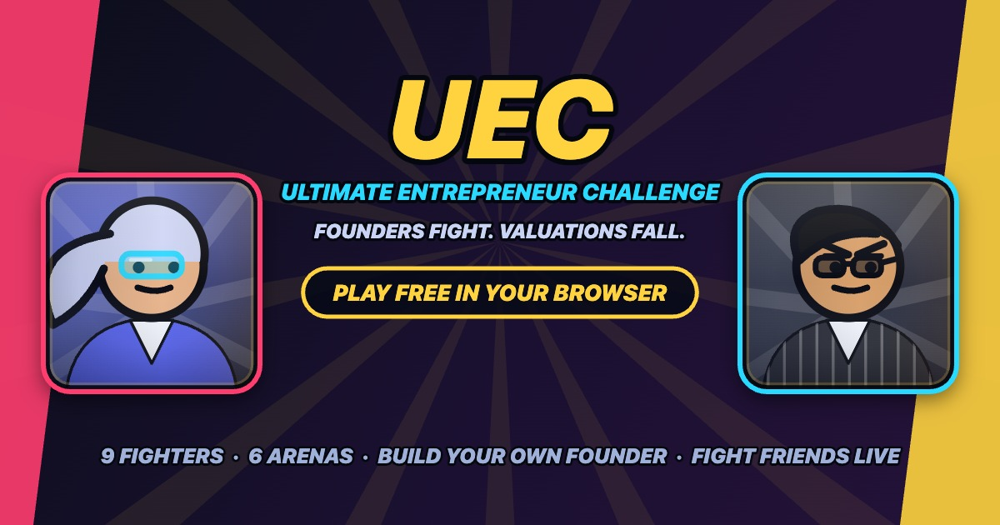
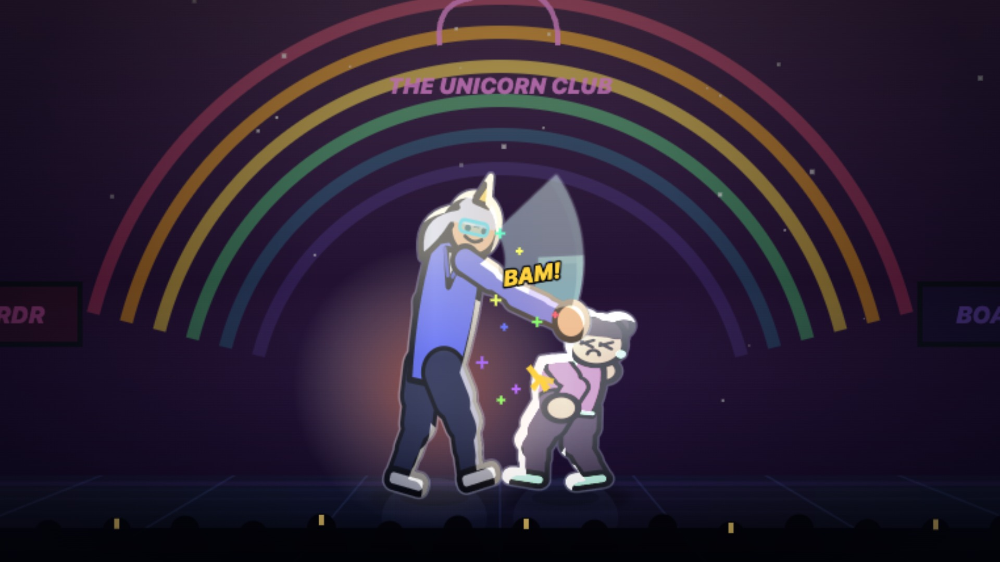
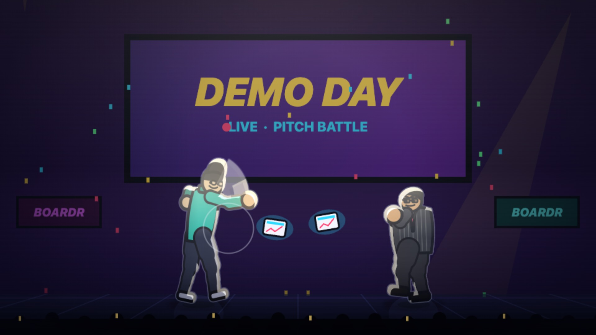

# UEC — Ultimate Entrepreneur Challenge 🥊



**Founders fight. Valuations fall.** A launch-ready browser arcade fighter where entrepreneurs battle 1-v-1 with Pitch Deck Strikes, Hostile Takeovers and full-meter **UNICORN MODE** — inspired by the pacing of 1990s arcade fighters, built with a fully original cast, art, and sound.

Playable in seconds: no account, no install, no build step. **100% vanilla JavaScript + Canvas + Web Audio — zero dependencies, zero asset files.** Every sprite is drawn and every sound is synthesized in code, so there is nothing to license and nothing to download.

---

## Quick start

Any static file server works. From this folder:

```bash
# option A (nothing to install)
python3 -m http.server 4173

# option B (dev server with no-cache headers — best while editing)
python3 dev-server.py 4173

# option C (Node)
npx serve -l 4173 .
```

Open **http://localhost:4173** → hit **⚡ QUICK FIGHT**. You're in a match in ~5 seconds.

> ES modules require http(s) — opening `index.html` via `file://` won't work.

## Deploy (any static host)

The whole game is static files. Drop the folder on any of:

- **Vercel** — `npx vercel deploy` (or import the folder in the dashboard; no build command, output dir = `.`)
- **Netlify** — drag-and-drop the folder into the dashboard
- **GitHub Pages** — push and enable Pages
- **Cloudflare Pages** — direct upload

No environment variables, no server, no database.

---

## How to play

Win **2 of 3 rounds** (60 s each): empty your rival's health bar or lead when the bell rings. Landing and taking hits charges your **energy meter** — spend 50 on your Special, or bank a full 100 for **UNICORN MODE** (6 s: +35 % damage, +25 % speed, no chip damage, extremely fabulous).

**Block** cuts damage to 15 % chip (chip can never KO). **Hostile Takeover can't be blocked — jump it.**

| Action | Solo | 2P — left player | 2P — right player | Touch |
|---|---|---|---|---|
| Move | ← → or A D | A D | ← → | ◀ ▶ |
| Jump | ↑ or W | W | ↑ | ▲ |
| Block / parry | ↓ or S | S | ↓ | 🛡 |
| Slap | H or X | X | H | 🖐 |
| Punch | J or C | C | J | 👊 |
| Kick | K or V | V | K | 👟 |
| Special | L or B | B | L | ⚡ |
| Cease & Desist | I or F | F | I | ⚖️ |
| Acqui-Hire (steal) | M or T | T | M | 💸 |
| Dash | O or R | R | O | 💨 |
| Unicorn Mode | U or G | G | U | 🦄 |
| Pause | Esc / P | | | ⏸ |

Touch pads appear automatically on phones/tablets (or force them with `?touch=1`).

**Combos — one rule.** When an attack **lands**, cancel it into **any other basic**. No ladder, no order to memorise: 🖐 slap, 👊 punch, 👟 kick and 🚀 launch all chain into each other, up to 5 basics per string, then a finisher (⚡ special / ⚖️ Cease & Desist / 💸 Acqui-Hire / 🦄 Unicorn). Later hits deal scaled damage, and 3 / 5 / 7 / 10 hits pop **COMBO! / SYNERGY! / DISRUPTED! / ACQUIRED!**

**Command normals — hold ➡ toward your rival as you press a basic** and you get that character's own version of the move. Carl Icahnt turns 👟 into an unblockable **ASSET SEIZURE**; Kim Koindashian turns 👊 into **PUMP** (launches, so she can juggle) and 👟 into **RUG PULL** (a trap on the floor). Every character's moves are listed on the select screen and on the pause menu.

**Parry:** tap block at the instant a hit lands (0.12 s window) — the attacker staggers and you gain energy. Grabs beat parries; parries beat everything else.

## What's new in v2.5 — build your own founder

v2.4 gave the cast their own moves. v2.5 gives you yours.

- 🧬 **Build your founder.** In your profile: shape your silhouette, then pick signature moves off a menu — a launcher, an unblockable command grab, a floor trap, a counter stance, a low sweep that outranges your punch. They come out on **hold ➡ toward your rival + the button**, same as the roster's.
- ⚖️ **You cannot buy an advantage.** Everyone in UEC hits equally hard, and that hasn't changed. What you can do is **trade**. A stronger move has to be paid for — with a weaker one, or with a bigger body that's easier to hit. Your build has to balance to zero, and the game won't let you save it until it does. Silhouette is free: shoulders, leg length and head size cost nothing at all, so you can look like nobody else without owing anything.
- ✨ **Suggest a build** seeds one from your name, so no two founders start the same.
- 🔗 **Your founder travels.** Challenge links carry your shape and your moves, so the AI ghost your friends fight is the fighter you actually built.
- 🫁 **Every fighter now breathes differently.** Carl shifts his weight slowly and doesn't fidget. Kim bounces twice per breath and is never quite still. Cathie is almost motionless — the stillness is the threat. Steve's presenting hand drifts up like he's about to say "one more thing".
- 🛠 **The Incubator** — an internal authoring tool with a live power-budget meter, a spar mode running the real AI, and a keyframe timeline editor. Not part of the game; it's how the roster gets made.

166 tests, up from 31 two releases ago.

## What's new in v2.4 — the character update

Every fighter now **moves** differently, **hits** differently, and is **recognisable by shape alone**.

- 🥊 **Command normals.** Hold forward as you press a basic and you get that character's own move. Everyone still shares identical controls — same movement, same block, same four basics, same universal moves — so uniqueness lives in 2–3 moves per character rather than in a wall of special cases. Two new fight patterns join the vocabulary: **counter** (a stance that turns an incoming strike back on its owner — grabs still beat it) and **trap** (a floor hazard that arms on its own clock and denies ground).
- 🎞 **Authored keyframe animation.** Attacks are hand-keyed in *phase space* — wind-up, hitbox out, recovery — so one track reads correctly on a 4-frame slap and a 12-frame kick alike. Nearly all the travel happens on the impact frame, and the pose is then **held** through the active window. Smooth easing from wind-up to strike is what made the old poses read as shoves.
- 🦾 **Arcade proportions.** Limbs have elbows and knees, taper from a thin upper arm into a heavy forearm into a glove, and boots point where the leg points. Two long-standing bugs surfaced once limbs were thick enough to see them: limbs were socketed to the *upright* torso while the torso itself leans, and a horizontal kicking leg ended in a flat plate seen edge-on.
- 🕴 **A roster you can tell apart in silhouette.** Every fighter has their own proportions and their own head outline. Cathie is the tallest and longest in the arm; Carl is a fireplug with the shortest legs and widest shoulders; Kim is small with an oversized head. Hair now changes the *shape* of a head rather than just its colour.
- ⚖️ **Nobody is over budget.** The power budget flagged PHANTOM as over-tuned back in v2.3.1 and it stayed that way. It is fixed — and no stat changed to fix it. *Slight and untouchable* is the compounding pattern the budget exists to catch, so giving Lizbeth an ordinary frame to hit is what pays for her speed.
- 🔒 **Challenge links and live matches now validate what they receive.** A hand-edited link with inflated frame data decodes to nothing, and a live match refuses to start rather than desyncing four seconds in and blaming the wifi.
- 🎉 **Victory beat** — confetti, a callout, and a pose that lands.

Under the hood: a character schema with a real validator, 139 tests, and a golden-image harness that pins every fighter in every state.

## What's new in v2.0 — the art pass

A full visual overhaul taking style cues from classic arcade fighters, in the game's own identity. **100% original**: no Street Fighter characters, logos, named moves, sounds or artwork — genre conventions only, the same originality rule the roster follows for Mortal Kombat.

- 🎨 **Cel-shaded fighters** — each fighter renders into an offscreen buffer, then a shading pass composites a form shadow, a warm-key/cool-fill directional split and a rim light across the whole silhouette at once. Because it's a *post-pass* rather than per-shape, it's **pose-independent**: every current and future animation frame is lit for free, with no per-frame art. Ink outlines thicken to match.
- 💡 **Cinematic stage lighting** — every arena gets a backdrop haze that pushes it back, a top key glow, a vignette that frames the action, and blurred layered contact shadows so fighters feel planted instead of pasted on.
- 🏛 **Arena depth** — a foreground layer drawn *in front* of the fighters, driven by each arena's own `mood`: crowd silhouettes with phone lights for Demo Day and the Unicorn Club, framing pillars for the Stock Exchange and VC Summit, a grounding floor shelf elsewhere.
- 🥊 **Punchier animation** — squash & stretch anchored at the feet, a deeper anticipation coil before every strike, stretch on release, jump rise/fall deformation, and a hard recoil snap on impact. Hitbox timing is untouched — it all comes from `ATTACKS` config, so the feel changed and the balance didn't.
- 🖼 **UI cohesion** — glossy gold-edged health bars, framed HUD portraits, dimensional buttons and panels, and a lighting pass on every portrait bust (kept deliberately light: a heavy grade turned the dark-suited fighters to mud at portrait size).
- 🎲 **The run continues** — after every fight: **NEXT FIGHT** (a fresh random rival, skipping the one you just fought), **FIGHT LIVE** (opens a live room to fight a real player) or **REMATCH**. No trip back to the menu between fights.

Perf cost of the whole pass: **~0.3 ms/frame**, roughly 98% headroom at 60 fps.

## What's new in v1.8

- 💇 **Your photo no longer erases your fighter.** Uploading a face used to replace the *entire* head, so `drawHair` and accessories were skipped and everyone came out bald and generic. A photo now replaces only the **face**: hair renders behind it (slightly oversized, so it frames the crop) and headwear renders on top.
- 🎨 **A real look customiser** — five independent layers in Founder Profile: **hair** (12 styles), **headwear** (cap, beanie, bandana, headband), **eyewear** (glasses, shades, AR visor), **facial hair** (stubble, moustache, goatee, beard) and **outfit** (9). With hair/suit/accent colours that's **10,800 combinations** before colours, and a 🎲 **SURPRISE ME** button. Every option is verified to render distinctly.
- 🧢 **Headwear never covers your eyes.** Everything is anchored above the brow line — hats riding down over the face was the worst thing about the old avatars.
- 👔 **Outfits are finally visible in portraits.** All nine used to collapse into "has a collar" or "doesn't" on the profile preview, leaderboard rows and challenge cards; each now has its own neckline (tie, pinstripes, hood + drawstrings, ribbed bomber collar, henley placket, crew neck, vest…).
- ☁️ **Your look follows your account** — synced to a whitelisted `look` column, so leaderboard avatars, challenge cards and live opponents all see the fighter you actually built. Live matches now also carry your photo-derived skin/hair, which they previously dropped.

## What's new in v1.7

- ⚖️ **You always fight as yourself.** "Choose your fighter" is gone — the select screen now picks your **rival**. Your own founder is the only fighter you ever control, so ranked points can only ever be earned as you.
- 📊 **Every player has identical stats** — `1.00 speed / 1.00 power / 100 HP`. Base characters are pure cosmetics. Previously a player inherited their look's stats, which spread `0.90–1.20` power: a wardrobe choice was worth up to a 33 % damage swing on a ranked ladder. Varied stats remain, but only on AI rivals.
- 🔐 **A founder profile is now required**, not suggested. New signups are routed straight into the builder and can't reach the arena until they've made themselves.
- 📐 **[The math is fully documented](docs/GAME-MATH.md)** — damage formula, combo scaling, meter economy, both points ladders, and the rank table, all with worked examples.
- 🔢 **Version is shown on the title screen** and lives in one place (`VERSION` in `src/config.js`).

## What's new in v1.6

- 🖐 **Slap** — a new fastest-and-weakest basic (4 dmg, 4-frame startup) that sits below punch on the combo ladder, with its own sharp-crack sound and open-hand pose. Purely for disrespect, mechanically for starting longer strings.
- 🔗 **Magic-series combos** — chains are now rank-based (slap → punch → kick): cancel into the same move up to its cap or anything stronger, never weaker. Routes run to 8+ hits.
- 📜 **The story** — an **About** screen laying out the lore: venture capital ran dry, so founders settle it in the ring and the winner takes whatever is left.
- 🧍 **16 base characters** — generic build-your-founder silhouettes for custom profiles (the parody roster stays as opponents), with no name labels on the picker.
- 🖼 **VS challenge cards** — an incoming challenge now shows both founders' real photos facing off with a **VS** in the middle.
- 🎚 **Difficulty renamed** to **Rookie / Contender / Champion**, and Steve Jobz became **Steve Nojobs**.
- 📧 **Private email capture** — signed-up emails land in a `user_emails` table that only the owner can read, deliberately kept out of the world-readable `profiles` table.

## What's new in v1.4

- 🕶 **Famous-founder roster** — the whole cast is now parody legends: **Lizbeth Holmez** (Theramos), **Adam Weumann** (WeWerk), **Steve Nojobs** (Pear), **Kim Koindashian** (SkimzCoin), **Cathie Woodz** (ARKK Capital), **Carl Icahnt** (Icahnt Holdings) + the cameo tier (Elo Ma, Jeff Bozo, Scam Alt). 100% satire, 0% affiliation.
- 🥊 **Combat feel pass** — punches/kicks are meaningfully faster (5-frame punch startup), with anticipation wind-ups, harder overshoot, motion-smear arcs and heavier hitstop. Mashing feels *good* now.
- ⚖️ **Cease & Desist** replaces the bomb: hurl legal paperwork in an arc (25 energy). You've been served.
- 💸 **Acqui-Hire** — new universal steal: raid their team at close range and siphon 15 energy into your meter (free, 3.5 s cooldown, blockable/parryable). Chains out of punches for maximum disrespect.
- 🛡 **PARRY** — tap block at the last instant to turn an attack away: attacker staggers, you gain energy. Grabs beat parries; parries beat everything else. Real skill ceiling unlocked.
- 💨 Dash got its proper emoji and moved next to the movement pad on touch.
- 🔐 **Sign-in system** (Google / Microsoft / email magic link via Supabase Auth) — built, wired, and gated behind `AUTH.REQUIRED` in [src/auth.js](src/auth.js) until providers are enabled (see below).

## Enabling sign-in (owner checklist)

**Step-by-step credential guide (Google & Microsoft consoles): [docs/AUTH-SETUP.md](docs/AUTH-SETUP.md).** Summary:

The game runs on its **own dedicated Supabase project** (`uec-game`, ref `oqzxkzkyiiahxmppgrkn`), isolated from other Aurmada projects. Sign-in needs the OAuth providers switched on. In the [Supabase dashboard](https://supabase.com/dashboard/project/oqzxkzkyiiahxmppgrkn):

1. **Authentication → URL Configuration** — set Site URL to `https://firdous-aurmada.github.io/uec-ultimate-entrepreneur-challenge/` and add it (plus `http://localhost:4173/**`) to Redirect URLs. **When you get a custom domain, add it here too** — the app code already uses whatever origin it's served from, so no code change is needed, only this allow-list entry.
2. **Authentication → Providers → Email** — enable (magic links work with no extra setup).
3. **Authentication → Providers → Google** — paste a Client ID/Secret from Google Cloud Console (authorized redirect URI: `https://oqzxkzkyiiahxmppgrkn.supabase.co/auth/v1/callback`).
4. **Authentication → Providers → Azure** — same with a Microsoft Entra app registration (same callback URI).
5. Flip `AUTH.REQUIRED` to `true` in `src/auth.js` and push — the game is now sign-in-gated.

> Billing: `uec-game` is a paid project (~$10/mo compute) so it stays always-on for live sign-in — no idle auto-pause.

## What's new in v1.3

- 🔗 **Real combos** — attacks now **cancel on hit**: chain Punch ×3 → Kick → Special / 💣 / 🦄. Whiffs still recover in full, chained hits scale down in damage (100/85/70/60/50%), chained jabs shove less so strings stay in range, and milestone callouts fire at 3/5/7 hits (COMBO! → SYNERGY! → DISRUPTED!). Founder and Mogul AIs chain back.

## What's new in v1.2

- 🎁 **Mystery drops** — briefcases parachute into every round carrying **hidden powers** (Secret Funding, 10x Engineer, Legal Shield, To The Moon… and the occasional Toxic Asset). Seeded RNG, so both players in a live match see identical drops.
- 💣 **PR Bomb** (25 energy, arcing blast) and ⚙️ **Hustle Dash** (free gap-closer that cancels into attacks) — two new universal moves on every fighter, keyboard + touch.
- 🕶 **Cameo tier** — three 100%-parody guest fighters: **ELO MA** (SPACEY-X), **JEFF BOZO** (PRIMEZON) and **SCAM ALT** (CLOSEDAI). No affiliation, all satire, very punchable.
- 📣 **Built-in bragging** — one-tap LinkedIn / X / WhatsApp share buttons and a copy-paste brag generator on the results screen. Your share link is your **challenge link**, so anyone who clicks your flex gets called out. Rank-ups get celebrated accordingly.

## The roster (all fictional)

| Fighter | Company | Signature special |
|---|---|---|
| **Lizbeth Holmez** · The Visionary | Theramos | 🔄 **Pivot Punch** — vanishes mid-claim, reappears fist-first |
| **Adam Weumann** · The Burner | WeWerk | 🔥 **Burn Rate Blast** — point-blank $47B inferno |
| **Steve Nojobs** · The Keynote | Pear | 📊 **Pitch Deck Strike** — one more thing: 3 razor slides |
| **Kim Koindashian** · The Influencer | SkimzCoin | 📈 **Growth Hack** — viral rush that locks in a 4-hit flurry |
| **Cathie Woodz** · The Believer | ARKK Capital | 💰 **Funding Round** — buys every dip, rains gold |
| **Carl Icahnt** · The Raider | Icahnt Holdings | 🦈 **Hostile Takeover** — unblockable command grab |

| Unicorn Mode in The Unicorn Club | Pitch Deck Strike on The Stock Exchange |
|---|---|
|  |  |

Everyone shares 🦄 **Unicorn Mode** at full meter. These roster fighters are **AI rivals only** — you always fight as your own founder. They have distinct speed/power/HP stats and AI personalities (aggression, jumpiness, preferred range) across three difficulties: **Rookie / Contender / Champion**. Human players all share one identical stat line; see **[docs/GAME-MATH.md](docs/GAME-MATH.md)**.

**Arenas (6, all animated):** The Boardroom · Demo Day · The Startup Garage · The Stock Exchange · The Unicorn Club · The VC Summit — with live tickers, sweeping spotlights, bouncing crowds, disco floors, and data-driven billboard slots (see *Sponsorships* below).

## Feature checklist

- ⚡ **Guest play** — no signup; first fight includes a 3-card tutorial + in-match hints
- 👤 **Founder profiles** — name, company, **photo upload with automatic face capture** (on-device face detection in every browser via a vendored MIT detector — picojs — with drag/pinch fine-tuning; photos never leave the device) → becomes your fighter's face, base style, custom suit/accent colors, choice of any signature special
- 🔴 **LIVE multiplayer** — create a room, send the link, and fight a friend in real time. The inviter is notified the second their rival joins; both pick fighters, the host picks the arena, and the match runs deterministic 60 Hz lockstep over Supabase Realtime with input-delay netcode, packet-loss healing, desync detection, both-consent rematches, and graceful disconnect handling. Backgrounded tabs keep simulating via a Web Worker so you never freeze your opponent.
- 🤖 **Vs AI** (3 difficulties) · 👥 **local 2-player** (one keyboard) · 🔗 **async call-out links** (serverless: the link carries your fighter; friends battle your AI ghost anytime)
- ⚔️ **Challenges screen** — live rooms, call-out links, and 10 seeded rival founders at their skill tier
- 🏆 **Leaderboard** — seeded season + you, with W-L, KOs, streaks and rank titles (Garage Dreamer → Decacorn)
- 📈 **Ranked points** — win = 20 × difficulty (×1/×1.5/×2.5, challenges ×2) + 5/KO round + streak bonus; a loss still pays +3
- 📸 **Shareable result cards** — 1200×630 PNG (download or native share)
- 🔊 **Sound controls** — master volume, music & SFX toggles, one-tap mute; all audio synthesized live
- 📱 **Mobile-ready** — responsive layouts + multi-touch pads; auto-pause when the tab hides
- 🔁 **Rematch / change fighter / restart** flows everywhere you'd expect

## Project layout

```
index.html            all screens & modals (DOM shell)
styles.css            visual system (arcade gold/pink/cyan on deep navy)
dev-server.py         no-cache static server for development
src/
  config.js           every gameplay number: physics, frame data, meter, points, ranks
  state.js            localStorage save: profile, stats, settings + challenge-link codec
  main.js             boot, screen router, match lifecycle, render loop, debug hooks
  data/fighters.js    roster definitions + specials metadata + custom/ghost builders
  data/arenas.js      six procedural animated arenas + sponsor billboard slots
  data/seed.js        seeded leaderboard entries
  engine/game.js      match controller: rounds, timer, hit resolution, KO cinematics
  engine/fighter.js   fighter entity: state machine, physics, attacks, specials
  engine/ai.js        AI controller (difficulty × per-fighter personality)
  engine/input.js     keyboard + multi-touch → virtual gamepads; Controller contract
  engine/drawFighter.js  procedural character rig, outfits, faces, photo heads, portraits
  engine/render.js    frame compositor (arena → shadows → fighters → projectiles → FX)
  engine/fx.js        particles, comic word popups, shake, hitstop, rings, flashes
  engine/audio.js     Web Audio SFX recipes + generative per-arena music loop
  ui/hud.js           health/energy bars, timer, pips, announcements, combos, hints
  ui/screens.js       select / profile / challenges / leaderboard / help / modals
  ui/resultCard.js    social result-card renderer
  ui/tutorial.js      first-fight onboarding
  net/online.js       future-multiplayer interface (see below)
```

**Seed data** lives in [src/data/seed.js](src/data/seed.js) (leaderboard) and [src/data/fighters.js](src/data/fighters.js) (roster). Adding a fighter = one object (identity, palette, stats, `special` id, AI personality). Adding an arena = one draw function + one entry in [src/data/arenas.js](src/data/arenas.js).

**Debug/test harness:** open with `?debug=1` to expose `window.UEC` (deterministic `step(seconds)`, `setHP`, `setEnergy`, `setTimer`, pad access) — the whole E2E suite runs through it. `?touch=1` forces touch pads on desktop.

## Online architecture (v1.1 — live and shipped)

Live matches run on **Supabase Realtime broadcast channels** — one ephemeral channel per room, nothing stored, no accounts. Presence powers the "your rival just joined" notification; both clients then run the same deterministic 60 Hz simulation and exchange only input bitmasks (delay-based lockstep, ~10 frames). Packets are wall-clock paced under the realtime rate limits, carry a sliding window with peer-acknowledged re-anchoring so packet loss self-heals, and a periodic state hash aborts cleanly on any desync. The engine's `Controller` contract is what makes this small: human, AI, and network players are interchangeable (see [src/net/online.js](src/net/online.js)).

## Roadmap

- 🔮 **Prompt-generated fighters & arenas** — describe a character or a battleground in words and generate your own. (Teased in-app; the procedural rig + arena system are built to accept new definitions.)
- 🌍 Global leaderboard is live (signed-in players, confirmed live matches). Custom SMTP for email sign-ups at scale + Google app verification are the remaining launch-polish items.

## Built for scaling — prepared but not enabled yet

- **Global leaderboard.** Rendering/sorting/rank logic is done; it reads one local array today. Swapping in a `fetch` keeps the UI untouched. Labeled "local season" in the UI.
- **Tournaments & seasons.** Match results flow through one `recordMatch()` chokepoint — brackets and season resets hook there.
- **Sponsorships.** Arena billboards rotate through a data array (`SPONSORS` in arenas.js) — real partners are a one-line swap.
- **Cosmetics.** Fighters are palette-driven (`c` object) with parameterized outfits/hair/accessories — skins are data, not art files.
- **More fighters/abilities.** Specials are typed behaviors (`projectile / aoe / teleport / rush / rain / grab`) — new abilities reuse or extend the type system in one place.

## Testing

Tested end-to-end in-browser (desktop + portrait/landscape mobile viewports): guest match, tutorial, profile + photo upload, every control on keyboard (both 2P schemes) and touch, all 6 signature specials + Unicorn Mode, KO/timeout/draw rounds, win & loss stat recording with exact point math, leaderboard placement, challenge-link round trip (generate → open → accept → fight ghost), rematch/restart/quit, pause, sound toggles, reset-all, and a zero-console-error sweep. Bugs found in testing (rush pass-through, base64url padding, card layout collisions, touch capture fragility, and more) were fixed before delivery.

## Legal / originality

All characters, names, companies, art, and audio are original and generated procedurally in code. No Mortal Kombat or other franchise characters, artwork, names, sounds, or assets are used. Inspiration is limited to the general conventions of the classic side-view arcade fighter.

---

Built with ❤️ and an unreasonable quantity of screen shake.
